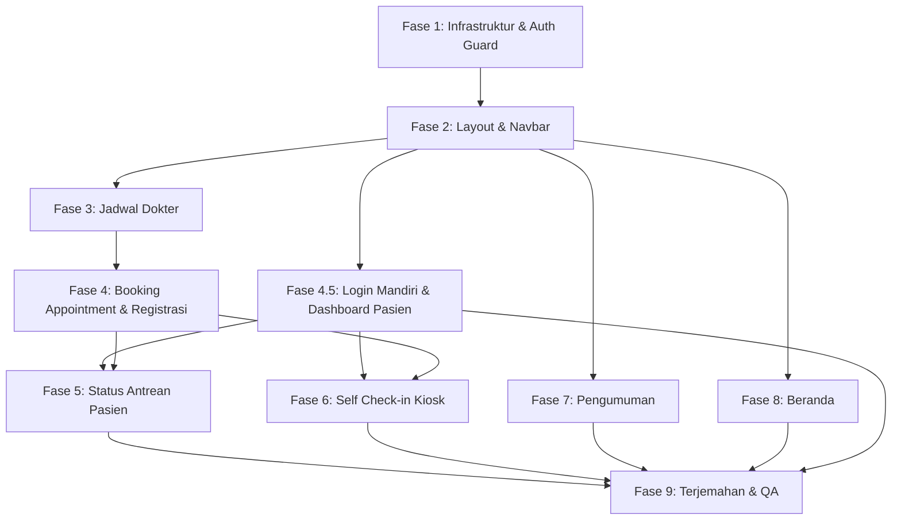

# Rencana Implementasi: Frontend Livewire — Klinik Ayo Sehat

Membangun halaman-halaman frontend publik dan pasien menggunakan **Livewire full-page components** sesuai PRD dan referensi desain visual yang sudah disediakan. Branding: **Klinik Ayo Sehat** (HealthQueue Portal Terpadu).

## Referensi Desain Visual

Semua halaman dibangun berdasarkan desain di [desain_frontend](file:///home/kurnia/HTDOCS/aplikasi/desain_frontend):

````carousel

<!-- slide -->

<!-- slide -->

<!-- slide -->

<!-- slide -->

<!-- slide -->

````

---

## Design System (dari [DESIGN.md](file:///home/kurnia/HTDOCS/aplikasi/desain_frontend/modern_clinical_flow_scheduling/DESIGN.md))

| Elemen | Detail |
|--------|--------|
| **Aesthetic** | Modern Clinical Clean — presisi medis + kehangatan wellness hospitality |
| **Primary** | `#005C55` (deep teal) / Container: `#0F766E` |
| **Secondary** | `#006A61` / Container: `#86F2E4` |
| **Brand Navy** | `#082747` (navbar, hero backgrounds) |
| **Brand Gold** | `#FBBA15` (akreditasi badge) |
| **Canvas** | `#F8FAFC` / Card: `#FFFFFF` |
| **Status** | Available: `#059669`, Limited: `#D97706`, Full: `#DC2626` |
| **Headline Font** | Plus Jakarta Sans (700, 600) |
| **Body Font** | Inter (400, 500, 600) |
| **Icons** | Material Symbols Outlined |
| **Border Radius** | Card: `1rem`, Modal: `1.5rem`, Pill/chip: `9999px` |
| **Container Max** | `75rem` (1200px) |

---

## Kondisi Saat Ini

- ✅ Model lengkap: `Doctor`, `Schedule`, `Appointment`, `Patient`, `QueueTicket`, `Announcement`
- ✅ Filament Admin panel aktif di `/admin`
- ✅ Multibahasa: `spatie/laravel-translatable`, `filament-language-switch`, file `lang/id.json` & `lang/en.json`
- ✅ Tailwind CSS 4 + Vite + Livewire 4 sudah terpasang
- ❌ Belum ada guard `patient` di `config/auth.php`
- ❌ Belum ada Livewire component frontend
- ❌ Belum ada layout dan route untuk frontend

---

## Keputusan Desain

> [!IMPORTANT]
> **Branding**: Nama klinik = **"Klinik Ayo Sehat"**, subtitle = "HealthQueue Portal Terpadu". Logo akan menggunakan gambar dari `desain_frontend/klinik_sehat_medika_logo/screen.png` (dicopy ke `public/images/logo.png`).

> [!IMPORTANT]
> **Autentikasi & Portal Mandiri Pasien**: Pasien dapat melakukan **Login Mandiri** kapan saja (`/patient/login`) tanpa harus memilih jadwal dokter atau membuat janji temu baru. Setelah berhasil login, pasien langsung mengakses **Dashboard / Portal Pasien** (`/patient/dashboard`) untuk melihat:
> 1. **Daftar Janji Temu / Booking Sebelumnya**: Menampilkan riwayat dan status reservasi (Confirmed, Checked-in, Completed, Cancelled) beserta detail dokter, tanggal, sesi, dan kode barcode.
> 2. **Tiket & Status Antrean Aktif**: Memantau nomor antrean aktif hari ini, status panggilan, estimasi tunggu, dan ruangan poliklinik.
> 3. **Aksi Terpadu**: Melakukan Self Check-in mandiri untuk janji temu hari H, membatalkan janji temu, atau membuat reservasi baru dari dashboard.

> [!IMPORTANT]
> **Audio Notifikasi Antrian**: Display antrian akan menggunakan **Web Speech API** (`speechSynthesis`) untuk memanggil nomor antrian secara audio + **audio bell/chime** (file `.mp3`) sebagai attention grabber sebelum pengumuman suara.

---

## Proposed Changes

---

### Fase 1 — Infrastruktur & Konfigurasi

#### [MODIFY] [auth.php](file:///home/kurnia/HTDOCS/aplikasi/config/auth.php)
- Guard `patient` (driver: `session`, provider: `patients`)
- Provider `patients` (driver: `eloquent`, model: `Patient`)

#### [MODIFY] [web.php](file:///home/kurnia/HTDOCS/aplikasi/routes/web.php)
Semua route frontend:
```php
// Public pages
Route::get('/', HomePage::class)->name('home');
Route::get('/doctors', DoctorSchedule::class)->name('doctors.index');
Route::get('/announcements', AnnouncementList::class)->name('announcements.index');
Route::get('/announcements/{slug}', AnnouncementDetail::class)->name('announcements.show');
Route::get('/queue/display', QueueDisplay::class)->name('queue.display');

// Booking flow (guest / auto-filled jika login)
Route::get('/booking', AppointmentBooking::class)->name('booking.index');

// Patient Auth (Login Mandiri - Guest Only)
Route::middleware('guest:patient')->group(function () {
    Route::get('/patient/login', PatientLogin::class)->name('patient.login');
});

// Patient Authenticated (Dashboard, Janji Temu & Antrean)
Route::middleware('auth:patient')->group(function () {
    Route::get('/patient/dashboard', PatientDashboard::class)->name('patient.dashboard');
    Route::get('/patient/queue', PatientQueue::class)->name('queue.index');
    Route::post('/patient/logout', function (Request $request) { ... })->name('patient.logout');
});

// Self Check-in (public, kiosk mode)
Route::get('/check-in', SelfCheckIn::class)->name('checkin.index');
```

#### [NEW] [SetLocale.php](file:///home/kurnia/HTDOCS/aplikasi/app/Http/Middleware/SetLocale.php)
- Middleware membaca locale dari session/cookie → `app()->setLocale()`
- Register di route group frontend

#### [MODIFY] [app.css](file:///home/kurnia/HTDOCS/aplikasi/resources/css/app.css)
- Tambah `@source` untuk Livewire views
- Tambah custom CSS variables sesuai design system (colors, typography, spacing)
- Import Google Fonts: Plus Jakarta Sans + Inter

#### [MODIFY] [vite.config.js](file:///home/kurnia/HTDOCS/aplikasi/vite.config.js)
- Tambahkan font Google Fonts (Plus Jakarta Sans + Inter) via Bunny Fonts

#### [NEW] Salin aset gambar ke `public/images/`:
- `logo.png` ← dari desain logo
- `receptionist.png` ← dari desain resepsionis (hero section)
- `notification-bell.mp3` ← audio bell untuk antrian

---

### Fase 2 — Layout & Komponen Blade

Dibangun berdasarkan header/footer yang konsisten di semua desain HTML.

#### [NEW] [frontend.blade.php](file:///home/kurnia/HTDOCS/aplikasi/resources/views/layouts/frontend.blade.php)
Master layout sesuai desain:
- **Top bar (navy)**: Badge akreditasi + Layanan IGD 24 Jam + Hotline darurat
- **Navbar**: Logo "Klinik Ayo Sehat" + subtitle "HealthQueue Portal Terpadu", navigasi utama, tombol pintas TV Monitor, pemilih bahasa (ID/EN), serta kontrol autentikasi pasien:
  - **Jika Belum Login (Guest)**: Tombol sekunder **"Masuk Pasien"** (`/patient/login`) dan tombol primer **"Daftar & Booking"** (`/booking`).
  - **Jika Sudah Login (Authenticated Patient)**: Avatar profil pasien dengan dropdown:
    - Ringkasan nama dan No. Rekam Medis (MRN)
    - Tautan ke **"Dashboard Pasien"** (`/patient/dashboard`)
    - Tautan ke **"Antrean Aktif Saya"** (`/patient/queue`)
    - Tombol **"Keluar"** (`/patient/logout`)
- **Footer**: 4 kolom — Info klinik & alamat, Layanan Poliklinik, HealthQueue Digital, Jam Operasional. Copyright bar.
- Slot untuk `@livewire` content + `@stack('scripts')`
- SEO meta tags

#### [NEW] [queue-display.blade.php](file:///home/kurnia/HTDOCS/aplikasi/resources/views/layouts/queue-display.blade.php)
- Layout khusus full-screen untuk TV/monitor (tanpa navbar/footer, dark background)

#### [NEW] [language-switcher.blade.php](file:///home/kurnia/HTDOCS/aplikasi/resources/views/components/frontend/language-switcher.blade.php)
- Dropdown toggle ID ↔ EN, simpan locale di session/cookie

---

### Fase 3 — Halaman Jadwal Dokter & Poliklinik (`/doctors`)

Referensi: desain `jadwal_dokter_poliklinik_1`

#### [NEW] [DoctorSchedulePage.php](file:///home/kurnia/HTDOCS/aplikasi/app/Livewire/Frontend/DoctorSchedulePage.php)
#### [NEW] [doctor-schedule-page.blade.php](file:///home/kurnia/HTDOCS/aplikasi/resources/views/livewire/frontend/doctor-schedule-page.blade.php)

Fitur (sesuai desain):
- **Hero Section (navy background)**: Breadcrumb, judul "Temukan Jadwal Dokter & Reservasi Spesialisasi", deskripsi, badge "Sistem Sinkron RS-SIM"
- **Search & Filter Panel (white card)**: Input nama dokter, dropdown poliklinik/spesialisasi, date picker tanggal berobat, tombol Cari & Reset. Filter hari pills (Semua Hari, Senin-Sabtu)
- **Live Queue Ticker**: Banner hijau menampilkan antrian terkini yang sedang dipanggil + rata-rata waktu tunggu
- **Kategori Spesialisasi**: Grid icon cards per spesialisasi (Penyakit Dalam, Anak, Kandungan, Jantung, Gigi, Neurologi) dengan jumlah dokter aktif
- **Daftar Dokter Tersedia**: Cards 2-kolom per dokter:
  - Foto, nama, spesialisasi, STR, kota
  - Sesi praktik (jam, kuota), badge quota real-time (Tersedia/Sisa Sedikit/Penuh)
  - Hari aktif pills (Sn, Sl, Rb, dll)
  - Tombol "Reservasi Janji Temu" → redirect ke `/booking/{schedule}` + "Profil Lengkap"
- **Matriks Jadwal Mingguan**: Tabel dokter × hari dengan sesi & kuota. Tombol Cetak PDF & Sinkronisasi Kalender
- **Panduan Alur Pendaftaran**: 4 step cards (Pilih Dokter → Isi Data → Check-in → Pantau Antrian)
- **CTA Banner**: "Butuh Bantuan Pendaftaran Jadwal?" + WhatsApp Admission

---

### Fase 4 — Booking Appointment & Registrasi Terintegrasi (`/booking`)

Referensi: desain `booking_janji_temu_dokter`

#### [NEW] [BookingPage.php](file:///home/kurnia/HTDOCS/aplikasi/app/Livewire/Frontend/BookingPage.php)
#### [NEW] [booking-page.blade.php](file:///home/kurnia/HTDOCS/aplikasi/resources/views/livewire/frontend/booking-page.blade.php)

**Multi-step wizard** (3 tahap) dengan progress bar:

**Tahap 1 — Pilih Sesi & Waktu:**
- Calendar strip (pilih tanggal, tampilkan status per hari: Penuh/Sisa/Tersedia)
- Slot jam kunjungan dengan kuota per slot
- Badge dokter yang dipilih (dari parameter route)

**Tahap 2 — Data Pasien & Keluhan:**
- **Jika belum login**: Tampilkan form registrasi inline:
  - Radio: Pasien Baru / Pasien Kontrol
  - No. RM / NIK (autocomplete untuk pasien lama)
  - Nama lengkap, WhatsApp, tanggal lahir, jenis kelamin, golongan darah
  - Email & password (untuk membuat akun)
  - Link "Sudah punya akun? Login di sini"
- **Jika sudah login**: Data pasien terisi otomatis
- Keluhan utama & riwayat (textarea)
- Upload rujukan/resep (optional)
- Pilihan pembayaran: Pasien Umum / BPJS / Asuransi Swasta
- Checkbox persetujuan tata tertib

**Tahap 3 — Konfirmasi Booking:**
- Ringkasan lengkap (dokter, jadwal, data pasien, estimasi biaya)
- Tombol "Konfirmasi Booking Sekarang"
- Generate `booking_code` → tampilkan kode booking + estimasi antrian

**Sidebar (desktop):**
- Ringkasan Janji Temu: Foto dokter, nama, poli, ruangan
- Estimasi No. Antrian + tanggal + sesi
- CTA "Butuh Bantuan Reservasi?" → WhatsApp

**Logic:**
- Registrasi pasien baru → create `Patient` + auto login guard `patient`
- Create `Appointment` (status: `pending` / `confirmed`)
- Generate `booking_code` format `APT-YYYYMMDD-XXXX`
- Validasi kuota (tidak boleh melebihi `max_patients`)

---

### Fase 4.5 — Autentikasi Mandiri & Portal Pasien (`/patient/login` & `/patient/dashboard`)

Pasien dapat login langsung ke akun mereka kapan saja tanpa harus melalui alur pemesanan jadwal atau membuat janji temu baru.

#### [NEW] [PatientLogin.php](file:///home/kurnia/HTDOCS/aplikasi/app/Livewire/Frontend/PatientLogin.php)
#### [NEW] [patient-login.blade.php](file:///home/kurnia/HTDOCS/aplikasi/resources/views/livewire/frontend/patient-login.blade.php)
- **Desain**: Form login modern berestetika *Clinical Clean*, kartu putih di atas background lembut, logo klinik, badge keamanan data terenkripsi.
- **Input Kredensial**:
  - Identifier: NIK (16 digit), Nomor Rekam Medis (RM), atau Email
  - Kata Sandi akun pasien
  - Checkbox "Ingat Saya" (Remember Me)
- **Autentikasi**: Guard `Auth::guard('patient')->attempt(...)`
- **Keamanan**: Rate limiting pencegah brute-force (5 percobaan per menit)
- **Tautan Navigasi**:
  - "Belum punya akun? Registrasi & Buat Janji Temu" → mengarahkan ke `/booking`
  - "Lupa kata sandi? Hubungi Bantuan WhatsApp Admisi"
- **Redirect**: Setelah berhasil login, langsung diarahkan ke `/patient/dashboard` (atau intended URL jika sebelumnya mengakses halaman yang membutuhkan login).

#### [NEW] [PatientDashboard.php](file:///home/kurnia/HTDOCS/aplikasi/app/Livewire/Frontend/PatientDashboard.php)
#### [NEW] [patient-dashboard.blade.php](file:///home/kurnia/HTDOCS/aplikasi/resources/views/livewire/frontend/patient-dashboard.blade.php)
Halaman portal pribadi pasien setelah login:
- **1. Header & Profil Ringkas**:
  - Salam pembuka personal ("Selamat Datang, Budi Santoso"), badge nomor rekam medis (`MRN: RM-2026-0001`), NIK, nomor telepon, dan status pasien terdaftar.
  - Tombol aksi cepat: "Buat Janji Temu Baru" (`/booking`), "Check-in Mandiri Kiosk" (`/check-in`), dan "Keluar" (Logout).
- **2. Seksi "Antrean Aktif Hari Ini" (Active Queue)**:
  - Jika pasien memiliki antrean aktif pada hari ini (`QueueTicket` dengan status `waiting` atau `called`):
    - Tampilkan nomor antrean besar (misal: `A-003`), nama dokter, ruangan poliklinik, dan estimasi waktu giliran.
    - Status alur antrean (Checked-in → Menunggu → Dipanggil).
    - Tombol "Pantau Live Monitor Antrean" → `/patient/queue`.
- **3. Seksi "Janji Temu Saya" (My Appointments)**:
  - Tab navigasi: **Janji Temu Mendatang** vs **Riwayat Kunjungan**.
  - Setiap kartu reservasi menampilkan:
    - Kode booking (`BK-YYYYMMDD-XXXX`) dengan representasi barcode visual.
    - Foto & nama dokter, spesialisasi poliklinik, dan ruangan.
    - Tanggal berobat & sesi jam praktik.
    - Keluhan utama dan jenis penjamin (BPJS / Mandiri / Asuransi).
    - Status badge interaktif: `Confirmed` (Terkonfirmasi), `CheckedIn` (Sudah Check-in), `Completed` (Selesai), `Cancelled` (Dibatalkan).
    - **Aksi Mandiri**:
      - Tombol **"Self Check-in"**: Jika tanggal kunjungan adalah hari ini dan belum check-in, pasien bisa langsung mengonfirmasi kehadiran tanpa harus mengetik ulang kode.
      - Tombol **"Lihat Tiket Antrean"**: Jika sudah check-in, langsung membuka detail nomor tiket.
      - Tombol **"Batalkan Janji Temu"**: Modal konfirmasi pembatalan jika berhalangan hadir.
- **4. Widget Edukasi & Bantuan**:
  - Banner panduan tata tertib klinik, hotline WhatsApp admisi, dan tautan pengumuman terbaru.

---


### Fase 5 — Status Antrian Pasien (`/patient/queue`)

Referensi: desain `status_antrian_pasien`

#### [NEW] [QueueStatusPage.php](file:///home/kurnia/HTDOCS/aplikasi/app/Livewire/Frontend/QueueStatusPage.php)
#### [NEW] [queue-status-page.blade.php](file:///home/kurnia/HTDOCS/aplikasi/resources/views/livewire/frontend/queue-status-page.blade.php)

Fitur (sesuai desain):
- **Header**: Badge "HealthQueue Live Sync Active" + polling indicator
- **Search by Booking Code**: Input kode booking / Scan QR
- **Info Banner**: Peringatan agar berada di area tunggu 10 menit sebelum giliran
- **Panel Utama (8 kolom)**:
  - Badge kode booking + status ("Sedang Menunggu, Urutan ke-3")
  - **Nomor Antrian Anda**: Display besar (contoh `A-012 / 35 Kuota`)
  - **Estimasi Tunggu**: ± X Menit lagi
  - **Sedang Dipanggil Saat Ini**: Nomor + ruangan + badge "Live Konsultasi"
  - **Info Dokter**: Foto, nama, spesialisasi, counter/ruangan, jam sesi
  - **Alur Pelayanan**: Timeline visual (Checked-in → Menunggu → Dipanggil → Konsultasi → Selesai)
  - **Action Buttons**: "Dengarkan Panggilan Suara" (🔊), "Panduan Menuju Ruang", "Batalkan Antrean"
  - **Statistik Ruang Tunggu**: Pasien terlayani, rata-rata konsul, antrian menunggu, jam kedatangan dokter + chart beban antrian
- **Sidebar (4 kolom)**:
  - **Antrian Poliklinik Lain**: Daftar poliklinik aktif + nomor yang sedang dilayani + sisa antrian
  - **HealthQueue Voice Assist**: Toggle audio panggilan suara (ON/OFF)
  - **Perlu Bantuan Perawat?**: Tombol panggil staf
- **Audio Notification**: `wire:poll.5s` + JavaScript:
  - Saat nomor pasien dipanggil → play `notification-bell.mp3` + `speechSynthesis.speak("Nomor antrian A-012, silakan menuju ruang 204")`

---

### Fase 6 — Self Check-in Mandiri (`/check-in`)

Referensi: desain `self_check_in_mandiri`

#### [NEW] [SelfCheckInPage.php](file:///home/kurnia/HTDOCS/aplikasi/app/Livewire/Frontend/SelfCheckInPage.php)
#### [NEW] [self-check-in-page.blade.php](file:///home/kurnia/HTDOCS/aplikasi/resources/views/livewire/frontend/self-check-in-page.blade.php)

Fitur (sesuai desain):
- **Header Hero**: Badge "Kiosk Mandiri Fast-Track Active" + jam real-time, judul "Check-in Mandiri Janji Temu Klinik", info "60 menit sebelum sesi", badge Terminal Kiosk
- **Tab Navigation**: "Input Kode Booking / NIK" | "Pindai / Scan QR Code"
- **Panel Input** (7 kolom):
  - Input besar high-contrast untuk kode booking/NIK
  - Format otomatis helper
  - Shortcut samples untuk testing
  - Privacy notice (enkripsi data medis)
  - Tombol "Verifikasi & Terbitkan Tiket Antrian"
  - Aturan bisnis check-in (hari H, kuota aktif, toleransi waktu)
- **Panel Hasil** (5 kolom):
  - Tiket antrian: Nomor antrian besar + estimasi dipanggil + jumlah pasien lagi
  - Info Pasien (nama, NIK, BPJS status)
  - Status (Terkonfirmasi → Check-in Berhasil)
  - Info Dokter (nama, poli, ruangan, jam)
  - Kode verifikasi + QR code
  - Action: "Cetak Tiket Fisik (Thermal Print)", "Kirim ke WhatsApp", "Monitor Antrian"
  - Toast notification: "Operasi Berhasil, tiket terbit"
- **Panduan Setelah Check-in**: 4 step cards + badge "Standar Akreditasi KARS"
- **Audio**: Play notification sound saat check-in berhasil

---

### Fase 7 — Halaman Pengumuman (`/announcements`)

#### [NEW] [AnnouncementListPage.php](file:///home/kurnia/HTDOCS/aplikasi/app/Livewire/Frontend/AnnouncementListPage.php)
#### [NEW] [announcement-list-page.blade.php](file:///home/kurnia/HTDOCS/aplikasi/resources/views/livewire/frontend/announcement-list-page.blade.php)
- Daftar pengumuman (scope `published()`), urut terbaru, pagination 6/halaman
- Card: gambar featured, judul, ringkasan, tanggal
- Konten otomatis sesuai locale via `spatie/laravel-translatable`

#### [NEW] [AnnouncementDetailPage.php](file:///home/kurnia/HTDOCS/aplikasi/app/Livewire/Frontend/AnnouncementDetailPage.php)
#### [NEW] [announcement-detail-page.blade.php](file:///home/kurnia/HTDOCS/aplikasi/resources/views/livewire/frontend/announcement-detail-page.blade.php)
- Judul, gambar, konten lengkap (rich text), tanggal terbit
- Dynamic SEO meta, navigasi kembali

---

### Fase 8 — Halaman Beranda (`/`)

#### [NEW] [HomePage.php](file:///home/kurnia/HTDOCS/aplikasi/app/Livewire/Frontend/HomePage.php)
#### [NEW] [home-page.blade.php](file:///home/kurnia/HTDOCS/aplikasi/resources/views/livewire/frontend/home-page.blade.php)

Sections:
- **Hero**: Gambar resepsionis (`receptionist.png`), headline "Layanan Kesehatan Terpercaya Klinik Ayo Sehat", CTA "Booking Janji Temu" + "Lihat Jadwal Dokter"
- **Dokter Unggulan**: 4 kartu dokter teratas
- **Pengumuman Terbaru**: 3 pengumuman terbaru
- **Antrian Saat Ini**: Widget ringkasan antrian aktif
- **Info Klinik**: Jam operasional, alamat, kontak

---

### Fase 9 — Terjemahan Frontend

#### [MODIFY] [id.json](file:///home/kurnia/HTDOCS/aplikasi/lang/id.json) & [en.json](file:///home/kurnia/HTDOCS/aplikasi/lang/en.json)
Tambahkan 80+ key-value terjemahan baru untuk semua label frontend, termasuk:
- Navigasi, hero text, search filters, form labels
- Status badge (Tersedia/Sisa Sedikit/Penuh)
- Booking steps, queue display, check-in messages
- Announcement labels, footer links
- Audio notification messages

---

## Ringkasan File

| # | Aksi | Path | Referensi Desain |
|---|------|------|------------------|
| 1 | MODIFY | `config/auth.php` | — |
| 2 | MODIFY | `routes/web.php` | — |
| 3 | MODIFY | `resources/css/app.css` | DESIGN.md |
| 4 | MODIFY | `vite.config.js` | — |
| 5 | NEW | `app/Http/Middleware/SetLocale.php` | — |
| 6 | NEW | `resources/views/layouts/frontend.blade.php` | Header/footer dari semua desain HTML |
| 7 | NEW | `resources/views/layouts/queue-display.blade.php` | — |
| 8 | NEW | `resources/views/components/frontend/language-switcher.blade.php` | — |
| 9 | NEW | `app/Livewire/Frontend/HomePage.php` + view | Hero + receptionist image |
| 10 | NEW | `app/Livewire/Frontend/DoctorSchedule.php` + view | `jadwal_dokter_poliklinik_1` |
| 11 | NEW | `app/Livewire/Frontend/AppointmentBooking.php` + view | `booking_janji_temu_dokter` |
| 12 | NEW | `app/Livewire/Frontend/PatientLogin.php` + view | Form Login Mandiri Pasien |
| 13 | NEW | `app/Livewire/Frontend/PatientDashboard.php` + view | Portal & Riwayat Janji Temu Pasien |
| 14 | NEW | `app/Livewire/Frontend/PatientQueue.php` + view | `status_antrian_pasien` |
| 15 | NEW | `app/Livewire/Frontend/SelfCheckIn.php` + view | `self_check_in_mandiri` |
| 16 | NEW | `app/Livewire/Frontend/QueueDisplay.php` + view | Layar Antrean TV Ruang Tunggu |
| 17 | NEW | `app/Livewire/Frontend/AnnouncementList.php` + view | Daftar Berita & Pengumuman |
| 18 | NEW | `app/Livewire/Frontend/AnnouncementDetail.php` + view | Detail Pengumuman |
| 18 | NEW | `public/images/logo.png` | Logo HealthQueue |
| 19 | NEW | `public/images/receptionist.png` | Gambar hero |
| 20 | NEW | `public/audio/notification-bell.mp3` | Audio antrian |
| 21 | MODIFY | `lang/id.json` & `lang/en.json` | — |

**Total: ~25 file baru, ~7 file dimodifikasi**

---

## Urutan Implementasi



> [!NOTE]
> **Pemisahan Alur**: Fitur **Login Pasien Mandiri (`/patient/login`)** dan **Dashboard Riwayat Janji Temu & Antrean (`/patient/dashboard`)** beroperasi secara independen tanpa mewajibkan pasien memilih dokter/jadwal terlebih dahulu. Pasien yang sudah memiliki akun dapat langsung masuk, memantau antrean aktif hari ini, melihat rekam reservasi terdahulu, melakukan pembatalan, atau melakukan 1-click check-in.

---

## Verification Plan

### Automated Tests
```bash
php artisan route:list --path=/          # Verifikasi route frontend
php artisan route:list --path=/doctors
php artisan route:list --path=/booking
php artisan route:list --path=/patient
php artisan route:list --path=/check-in
npm run build                            # Pastikan asset Vite berhasil
```

### Manual Verification
- Buka setiap halaman di browser, bandingkan dengan screenshot desain
- Test flow lengkap: Register → Pilih Dokter → Booking → Check-in → Lihat Antrian
- Ganti bahasa ID ↔ EN → semua label berubah
- Test audio notifikasi di halaman antrian (pastikan bell + speech synthesis berfungsi)
- Test responsive: desktop, tablet, mobile
- Test login/register pasien: validasi, auto-login, redirect
